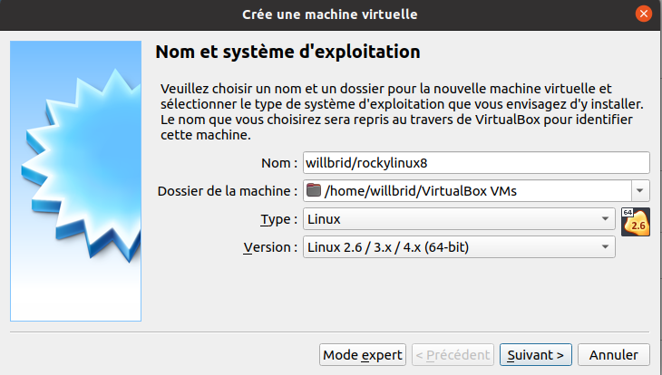

# Création de notre propre fichier vagrant box [Part1]
Nous supposerons que nous utilisons virtualbox **6.1.34**.
</br>
Dans cette partie, nous allons créer notre machine virtuelle virtualbox pour le système rocky linux 8.
</br>

## Installation d'une machine virtuelle virtualbox

Nous lançons virtualbox, puis nous suivrons les différentes étapes ci-dessous.

- Nous cliquons sur le menu **Machine** puis son sous menu **Nouvelle**

- Une interface s'ouvre. Nous configurons les valeurs de paramètres tels que présentées par l'image ci-après : 



- Une fois terminée, nous cliquons sur le bouton **Suivant** . Une interface de configuration de la mémoire de la machine virtuelle s'ouvre. Nous mettons la même valeur telle que définie sur la capture ci-après :


- Une fois la mémoire configuré, nous cliquons sur le bouton **Suivant** . Une interface de configuration du disque dur virtuel s'ouvre. Nous choisissons la même option telle définie sur la capture ci-après :


Puis nous cliquons sur le bouton **Créer**

- Une nouvelle interface s'ouvre où nous allons choisir le type de fichier de disque dur. Dans notre cas le type **VDI**. Puis nous cliquons sur le bouton **Suivant** .


- Une nouvelle interface s'ouvre où nous choisissons l'option de stockage du disque dur virtuel sur le disque dur physique. Puis nous cliquons sur le bouton **Suivant** .


- Une nouvelle interface s'ouvre où nous définissons la taille et l'emplacement du disque dur virtuel. Puis nous cliquons sur le bouton **Créer** .


- Pour cette machine virtuelle créée, nous la sélectionnons, puis nous faisons un clic droit et nous cliquons sur configuration.

-- Nous désactivons le contrôleur usb


-- Nous désactivons le son puis nous cliquons sur **OK**.


Notre machine virtuelle est prête !

## Installation du système rocky linux 8.6
Il s'agit d'installer le système Rocky linux avec pour mot de passe de d'utilisateur **root** **vagrant** et de créer un compte administrateur **vagrant** avec pour mot de passe **vagrant**.

## Configuration du système rocky linux 8.6
Une fois l'installation du système d'exploitation terminée, nous nous connectons sur la machine virtuelle rocky linux avec le compte vagrant, puis nous suivrons les différentes étapes ci-dessous.

- Importation de la clé publique vagrant

```
sudo dnf install wget
```

```
cd /home/vagrant
mkdir .ssh
```

```
wget https://raw.githubusercontent.com/hashicorp/vagrant/main/keys/vagrant.pub
```

```
mv vagrant.pub .ssh/authorized_keys
```

```
sudo chmod -R 0700 .ssh/
sudo chmod 0600 .ssh/authorized_keys
```

- Configuration de l'utilisateur vagrant pour exécuter **sudo** sans mot de passe

```
sudo visudo
```

```
vagrant ALL=(ALL) NOPASSWD: ALL
```

- Désactivation de l'option **UseDNS** du service ssh

```
sudo vi /etc/ssh/sshd_config
```

Nous recherchons la ligne contenant le mot clé **UseDNS**
```
UseDNS no
```

```
sudo systemctl restart sshd
```

Cela évite une recherche DNS inversée sur le client SSH qui se connecte, ce qui peut prendre plusieurs secondes.

- Installation de VBoxGuestAdditions 6.1.34 sur Rocky linux

Nous téléchargeons dans notre machine hôte le fichier iso **VBoxGuestAdditions_6.1.34.iso**
<br>
Lien : [virtualbox/6.1.34](https://download.virtualbox.org/virtualbox/6.1.34/)
<br>

Nous montons ce fichier iso dans notre machine virtuelle rocky linux en faisant un clic droit sur l'icône de disque en bas à droite sur la machine virtuelle, puis en choisissant **choose a disk file** .


Nous installons les dépendances nécessaires.
```
sudo dnf update
sudo dnf install epel-release
sudo dnf install gcc make perl kernel-devel kernel-headers bzip2 dkms
sudo dnf update kernel-*
```

Nous montons le fichier iso dans un répertoire du système, puis nous installons **VBoxGuestAdditions_6.1.34**.
```
sudo mkdir -p /mnt/cdrom
sudo mount /dev/cdrom /mnt/cdrom
cd /mnt/cdrom
sudo sh ./VBoxLinuxAdditions.run --nox11
sudo reboot
sudo umount /mnt/cdrom
sudo umount /dev/cdrom
sudo systemctl enable vboxadd
sudo systemctl enable vboxadd-service
```

Nous vérifions la présence du module **vboxguest**
```
lsmod | grep vboxguest
```

<br><br>

Source : [Vagrant BOX DOCS](https://www.vagrantup.com/docs/boxes/base)