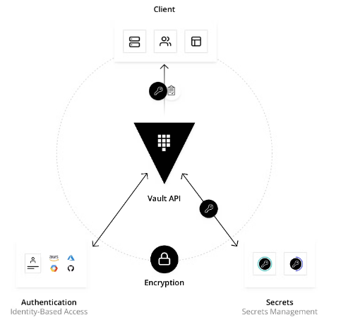

# Qu'est-ce que HashiCorp vault ?

1. **Définition**

**Vault** est un système de gestion des secrets et du chiffrement basé sur l'identité. Un secret est tout ce dont nous souhaitons contrôler étroitement l'accès, comme les clés de chiffrement API, les mots de passe et les certificats. **Vault** fournit des services de chiffrement protégés par des méthodes d'authentification et d'autorisation. À l'aide de l'interface utilisateur, de la CLI ou de l'API HTTP de **Vault**, l'accès aux secrets et autres données sensibles peut être stocké et géré en toute sécurité, étroitement contrôlé (restreint) et auditable.

 

Un système moderne nécessite l'accès à une multitude de secrets, y compris les informations d'identification de base de données, les clés API pour les services externes, les informations d'identification pour la communication de l'architecture orientée services, etc. Il peut être difficile de comprendre qui accède à quels secrets, d'autant plus que cela peut être une plate-forme spécifique. L'ajout d'un roulement de clés, d'un stockage sécurisé et de journaux d'audit détaillés est presque impossible sans une solution personnalisée. C'est là que **Vault** intervient.

2. **Comment fonctionne Vault ?**

Vault fonctionne principalement avec des jetons et un jeton est associé à la politique du client. Chaque politique est basée sur le chemin (path) et les règles de politique limitent les actions et l'accessibilité aux chemins pour chaque client. Avec Vault, nous pouvons créer des jetons manuellement et les attribuer à vos clients, ou les clients peuvent se connecter et obtenir un jeton. L'illustration ci-dessous présente le flux de travail principal de Vault.

 

Le workflow principal de **Vault** se compose de quatre étapes :

- Authentification : l'authentification dans Vault est le processus par lequel un client fournit des informations que Vault utilise pour déterminer s'il est bien celui qu'il prétend être. Une fois que le client est authentifié par rapport à une méthode d'authentification, un jeton est généré et associé à une stratégie.

- **Validation** : **Vault** valide le client par rapport à des sources de confiance tierces, telles que **Github**, **LDAP**, **AppRole**, etc.

- **Autorisation** : un client est mis en correspondance avec la politique de sécurité de **Vault**. Cette stratégie est un ensemble de règles définissant les points de terminaison d'API auxquels un client a accès avec son jeton **Vault**. Les stratégies fournissent un moyen déclaratif d'accorder ou d'interdire l'accès à certains chemins (paths) et opérations dans **Vault**.

- **Accès** : **Vault** accorde l'accès aux secrets, aux clés et aux capacités de chiffrement en émettant un jeton basé sur les politiques associées à l'identité du client. Le client peut ensuite utiliser son jeton **Vault** pour de futures opérations.

 

Quelques exemples d'informations confidentielles :
- Api Token
- Identifiant / mot de passe
- Certificat TLS 

HashiCorp vault possède plusieurs fonctionnalités :
- centralisation de l'emplacement de nos informations confidentielles
- contrôle d'accès précis aux informations confidentielles : qui peut accéder à quoi et quand
- accessibilité aux journaux qui nous indiquent essentiellement qui a accédé à quoi et quand
- gestion des informations d'identification dynamiques d'une durée de vie courte
- création des informations d'identification uniques par serveur ou par service.
- gestion des clés et cryptographie par la capacité de chiffrer les données en transit

Quelques ressources :
- site web HashiCorp vault : https://www.vaultproject.io
- documentation officielle : https://www.vaultproject.io/docs
- comparaison version non-entreprise et version entreprise : https://www.hashicorp.com/products/vault/pricing