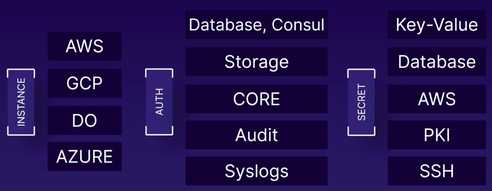
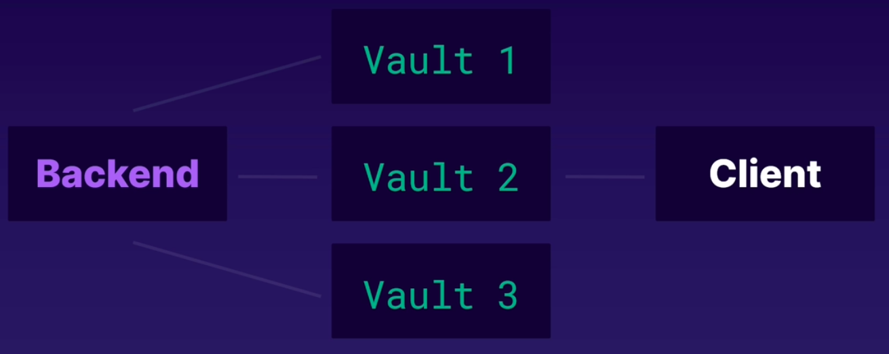

# Présentation de l'architecture de haut niveau

1. **Architecture et scénario d'identification**

Nous avons tout d'abord le coeur (core) où nous avons le **stockage** et le **stockage** peut être, essentiellement, une **base de données** ou un **consul** ou quelque chose dans le backend, qui permet le **stockage** des informations d'identification. Ensuite, nous avons l'**audit**, qui nous permet de nous connecter à la solution de journalisation externe, comme par exemple, ***syslogs**.

- Maintenant, un client entrerait et voudrait utiliser l'un des services sur AWS, ou juste une instance sur AWS, GCP, DigitalOcean et Azure. Et s'il veut s'authentifier auprès de l'un d'entre eux, il doit utiliser un certain type de **secret** autour duquel il existe généralement une sorte de politique : soit nous pouvons donc avoir un secret codé en dur, comme juste la clé-valeur ou soit nous pouvons avoir quelque chose de dynamique, comme pour les bases de données, n'importe quoi sur l'infrastructure AWS, l'infrastructure à clé publique ou SSH.

- Supposons qu'un client arrive et souhaite se connecter à l'instance sur GCP. Et cette instance, lorsqu'elle est créée, nous devons créer des informations d'identification SSH dynamiques pour elle. Nous avons donc une sorte de secret, qui est SSH ici. Ainsi, nous pouvons créer une politique, dans laquelle ces informations d'identification existent pendant un temps **x** où nous aurons besoin d'un changement après un temps **x**. Ainsi, une instance sur GCP est générée, des informations d'identification SSH sont créées pour elle, puis le client peut réellement utiliser ce secret. Comme lors de leur création, il est stocké ici dans une sorte de stockage qui est fourni, que nous choisissons, et il est journalisé par le système de journalisation, par la solution de journalisation que nous avons choisie.

- Nous voulons partager sur le stockage AWS S3 avec quelqu'un pendant 3 heures. Les informations d'identification d'un client seraient créées par un type de secret AWS, où il y'aurait une politique autour d'eux selon laquelle elles expirent après 3 heures. Elles seraient stockés ici dans le stockage et l'audit s'assurerait de les enregistrer via une solution de journalisation externe. 

- Nous pouvons adopter une approche similaire avec un client qui veut s'authentifier auprès d'une base de données DigitalOcean située sur le fournisseur de services cloud DigitalOcean. Il utiliserait les informations d'identification de la base de données dynamique, qui leur sont propres et qui sont uniques à cette base de données.

2. **Composition de l'architecture**

Prenons l'exemple de 3 instances **vault** qui partagent un **backend commun**. En général, le ou les clients communiqueraient avec une seule instance, qui serait un leader élu entre eux. Maintenant, si le leader élu tombe en panne, pour une raison quelconque par exemple une panne de courant dans le serveur ou autre, un autre leader serait élu. Et la communication passerait toujours sans aucun problème. Si le client, par hasard, communique avec d'autres instances **vault**, autre qu'avec le chef élu, la communication sera transmise au chef.
Encore une fois, il n'y avait qu'un seul chemin emprunté pour tout type de communication lorsque nous demandons une authentification et une autorisation à divers serveurs et services.

