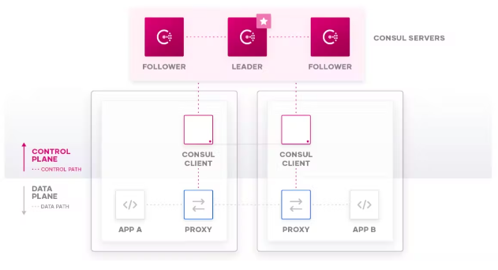

# Installation de Consul [PART1]

1. **Présentation de consul**

HashiCorp **Consul** est une solution de mise en réseau de services qui permet aux équipes de gérer une connectivité réseau sécurisée entre les services et dans les environnements et runtimes sur site et multi-cloud. **Consul** propose la découverte de services, le maillage de services, la gestion du trafic et des mises à jour automatisées du périphérique d'infrastructure réseau. Nous pouvons utiliser ces fonctionnalités individuellement ou ensemble dans un seul déploiement Consul.

<br>

**Consul** fournit un plan de contrôle qui vous permet d'enregistrer, d'interroger et de sécuriser les services déployés sur votre réseau. Le plan de contrôle est la partie de l'infrastructure réseau qui maintient un registre central pour suivre les services et leurs adresses IP respectives. Il s'agit d'un système distribué qui s'exécute sur des clusters de nœuds, tels que des serveurs physiques, des instances cloud, des machines virtuelles ou des conteneurs.

Consul interagit avec le plan de données via des proxys. Le plan de données est la partie de l'infrastructure réseau qui traite les demandes de données.



Le flux de travail principal du consul comprend les étapes suivantes :

- **Register** : les équipes ajoutent des services au catalogue **Consul**, qui est un registre central qui permet aux services de se découvrir automatiquement sans qu'un opérateur humain ne modifie le code de l'application, déployer des équilibreurs de charge supplémentaires ou coder en dur des adresses IP. C'est la source de vérité d'exécution pour tous les services et leurs adresses. Les équipes peuvent définir et enregistrer manuellement à l'aide de la CLI ou de l'API, ou alors nous pouvons automatiser le processus dans Kubernetes avec la synchronisation des services. Les services peuvent également inclure des bilans de santé afin que le **consul** puisse surveiller les services malsains.

- **Query** : le DNS basé sur l'identité de **Consul** nous permet de trouver des services sains dans le catalogue **Consul**. Les services enregistrés auprès de **Consul** fournissent des informations sur la santé, des points d'accès et d'autres données qui nous aident à contrôler le flux de données sur notre réseau. Nos services n'accèdent aux autres services que par l'intermédiaire de leur proxy local, conformément aux politiques basées sur l'identité que nous définissons.

- **Secure**: une fois les services localisés en amont, le **consul** s'assure que la communication de service à service est authentifiée, autorisée et cryptée. Le maillage de services **Consul** sécurise les architectures de microservices avec **mTLS** et peut autoriser ou restreindre l'accès en fonction des identités de service, quelles que soient les différences dans les environnements de calcul et les temps d'exécution.

2. **Installation** 

```
sudo yum install -y yum-utils
```

```
sudo yum-config-manager --add-repo https://rpm.releases.hashicorp.com/RHEL/hashicorp.repo
```

```
sudo yum -y install consul
```