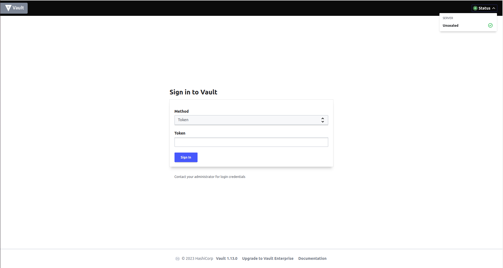
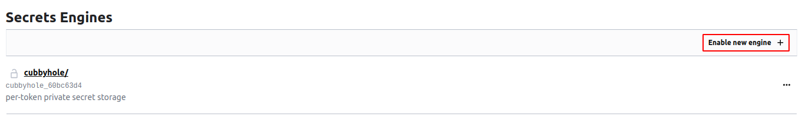
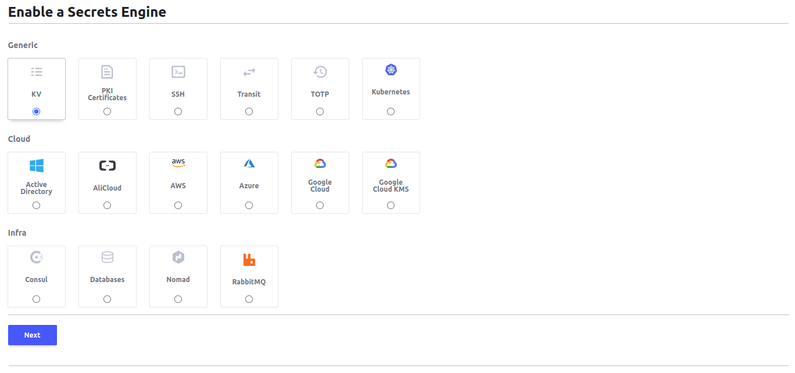
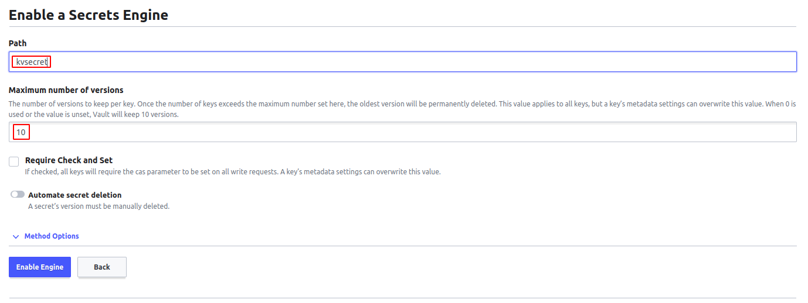
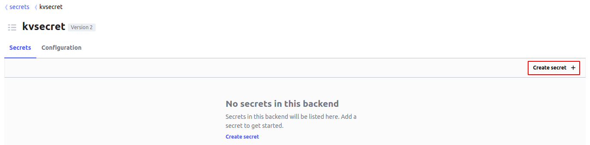
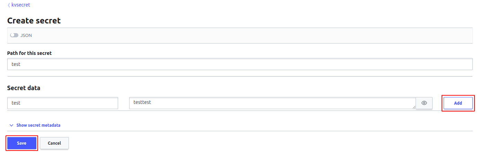
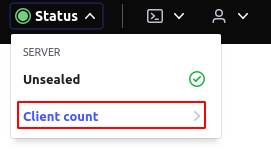
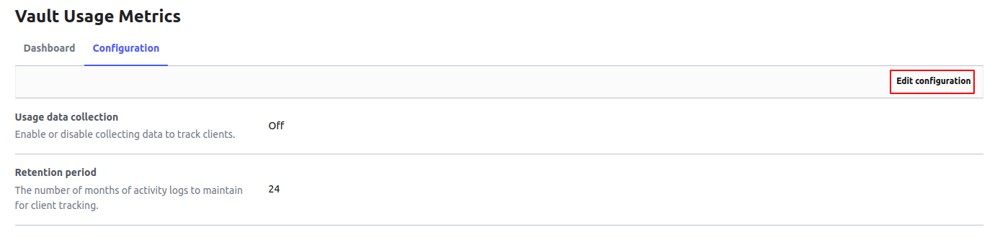
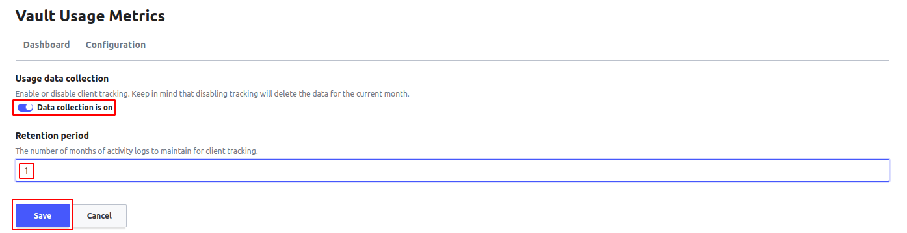

# Interface Web

- Connexion à l'interface web

Nous allons nous connecter à l'interface web utilisateur via un navigateur en utilisant l'url : 

```
https://notredomaine:8443
```

Si le service **firewalld** est installé, avant d'utiliser cette url nous devons ajouter le port 8443 dans la zone publique de notre paref-feu :

```
sudo firewall-cmd --zone=public --add-port=8443/tcp --permanent
sudo firewall-cmd --reload
```

Nous pouvons vérifier la règle avec la commande 

```
sudo firewall-cmd --list-all
```

Si tout se passe bien, à l'ouverture de notre interface web, nous aurons une page d'authentification



- Activation d'un nouveau moteur : kv (key value)

Nous cliquons sur le bouton **Enable new engine**.  



Ensuite nous sélectionnons **kv** et nous cliquons sur le bouton **next**.



Puis dans la nouvelle page, nous mentionnons le nom du chemin (path) **kvsecret** et nous précisons la valeur 10 pour définir le nombre de versions à conserver par clé. Une fois que le nombre de clés dépasse le nombre maximum défini ici, la version la plus ancienne sera définitivement supprimée.



- Création d'un nouveau secret sur le moteur kv

Nous accédons à notre nouveau moteur **kvsecret**, puis nous cliquons sur le bouton **create secret**.



Une page s'ouvre où nous mentionnons un nom du chemin (path) : **test** et une donnée de secret **key : test - valeur : testtest**. nous cliquons sur le bouton **Add**, puis sur **Save** pour enregistrer.



- Activation du tracking

Nous cliquons sur le menu **status** au niveau de la barre d'entête, puis sur le sous-menu **client count**. Une page s'ouvre où nous cliquons sur l'onglet **configuration**.



Ensuite nous cliquons sur le bouton **Edit configuration**.



Une page s'ouvre où nous activons le bouton **data collection**, puis nous définissons la rétention à **1 mois** enfin nous cliquons sur le bouton **save**.



Nous pouvons désactiver l'interface web ui en changeant la valeur de l'option **ui** de **true** en **false** dans le fichier **/etc/vault.d/vault.hcl**.

```
sudo vim /etc/vault.d/vault.hcl
```

```
ui = false
```

```
sudo systemctl restart vault
sudo systemctl status vault
```